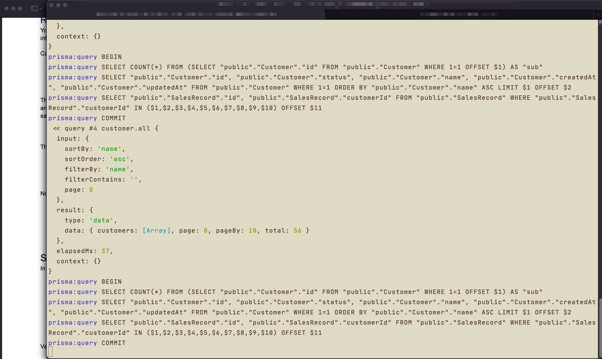
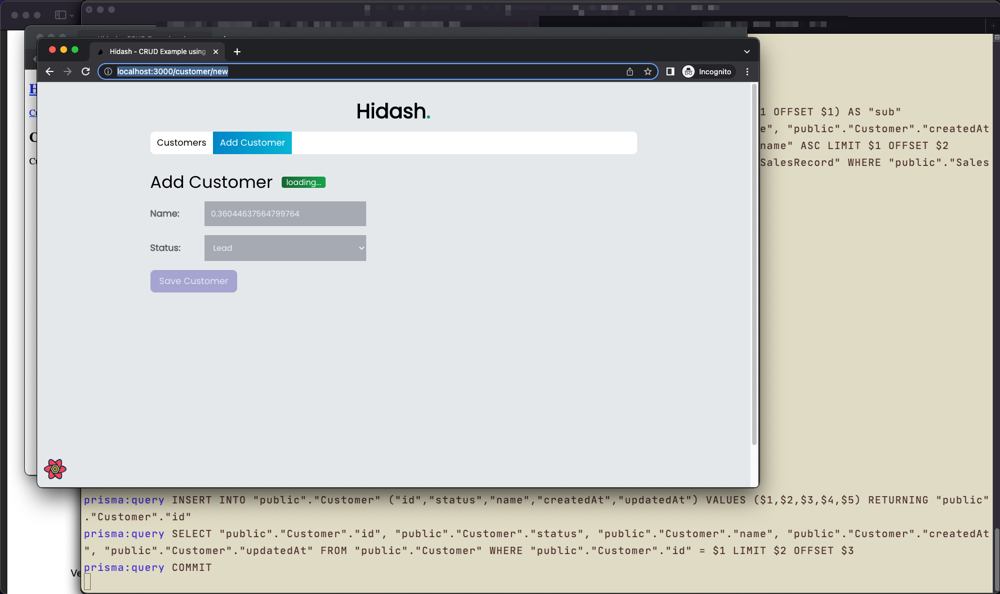
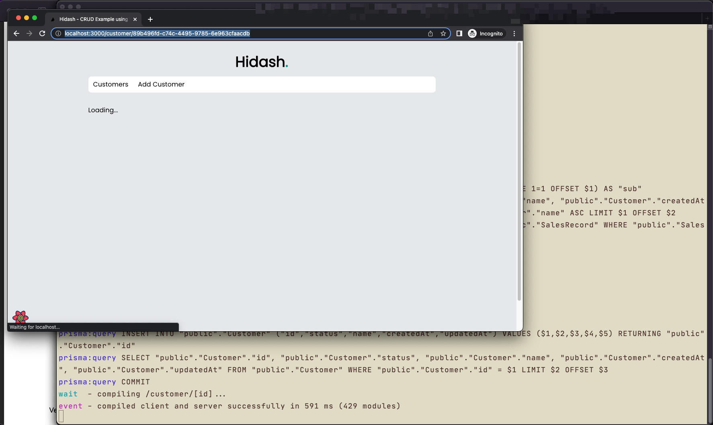
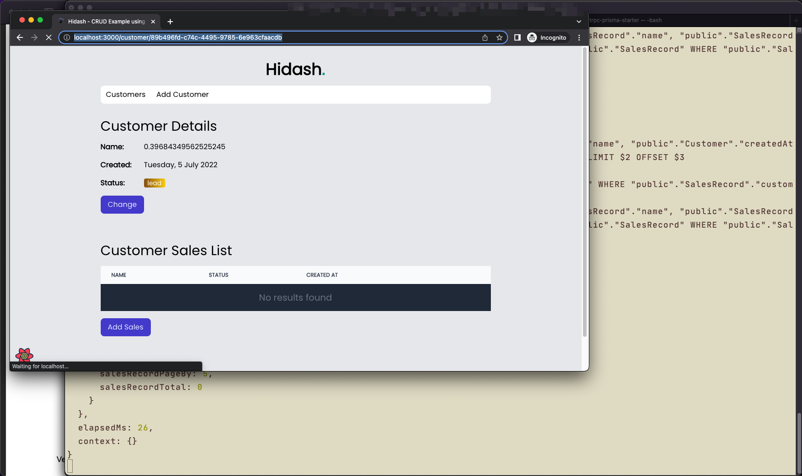
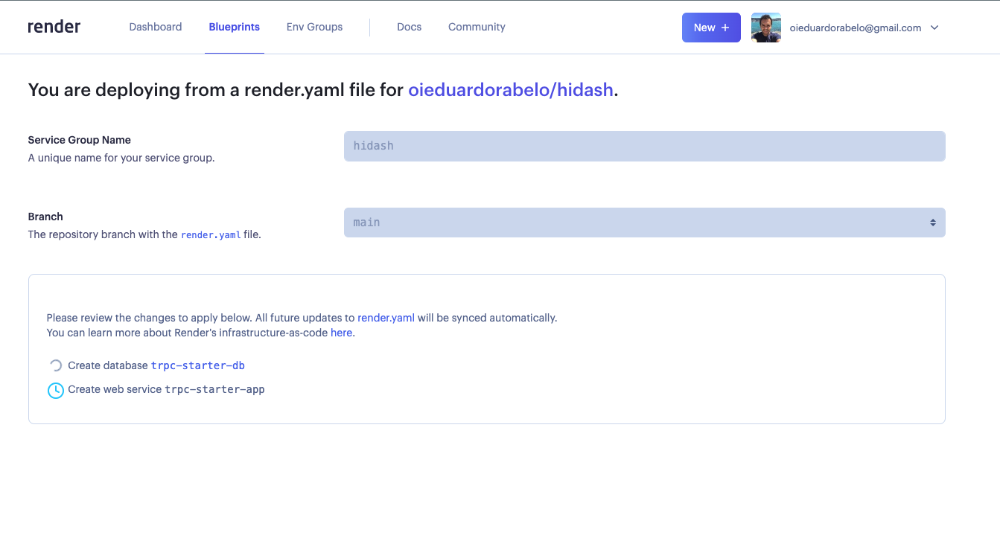

# CRUD Example using tRPC, Prisma ORM, React Query, Next.js and Tailwind CSS

### Features

- 🧙‍♂️ E2E typesafety with [tRPC](https://trpc.io)
- ⚡ Full-stack React with Next.js
- ⚡ tRPC routes are deployed in Vercel Lambda
- ⚡ Database with Prisma
- ⚙️ VSCode extensions
- 🎨 ESLint + Prettier
- 💚 CI setup using GitHub Actions:
  - ✅ E2E testing with [Playwright](https://playwright.dev/)
  - ✅ Linting
- 🔐 Validates your env vars on build and start
- 🐳 Docker and Docker Compose for local development

### Setup

**yarn:**

```bash
git clone git@github.com:oieduardorabelo/hidash.git
cd hidash
yarn
yarn dx
```

The `dx` command will make sure to:

- Download required Docker images
- Sync Prisma Schema with Postgres
- Generate TypeScript types and React Hooks based on SQL Schema
- Run Next.js in DEV mode

With that in place, you can run tests, develop new features and play with the UI!

### Requirements

- Node >= 14
- Docker (for running Postgres)

### Commands

```bash
yarn build      # runs `prisma generate` + `prisma migrate` + `next build`
yarn db-nuke    # resets local db
yarn dev        # starts next.js
yarn dx         # starts postgres db + runs migrations + seeds + starts next.js
yarn test-dev   # runs e2e tests on dev
yarn test-start # runs e2e tests on `next start` - build required before
yarn test:unit  # runs normal jest unit tests
yarn test:e2e   # runs e2e tests
```

### E2E testing with [Playwright](https://playwright.dev/)

With your local environment up and running, you can run and test e2e scenarios using Playwright.






### Deployment using [Render](https://render.com/)

The project contains a [`render.yaml`](./render.yaml) [_"Blueprint"_](https://render.com/docs/blueprint-spec) which makes the project easily deployable on [Render](https://render.com/).

Go to [dashboard.render.com/blueprints](https://dashboard.render.com/blueprints) and connect to this Blueprint and see how the app and database automatically gets deployed.

tRPC routes are deployed in Vercel Lambda taking advantaged of their global CDN.


